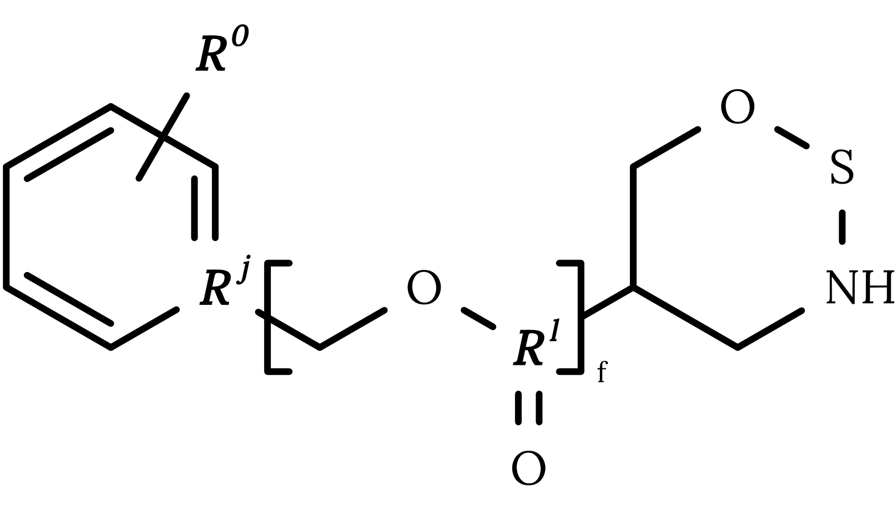
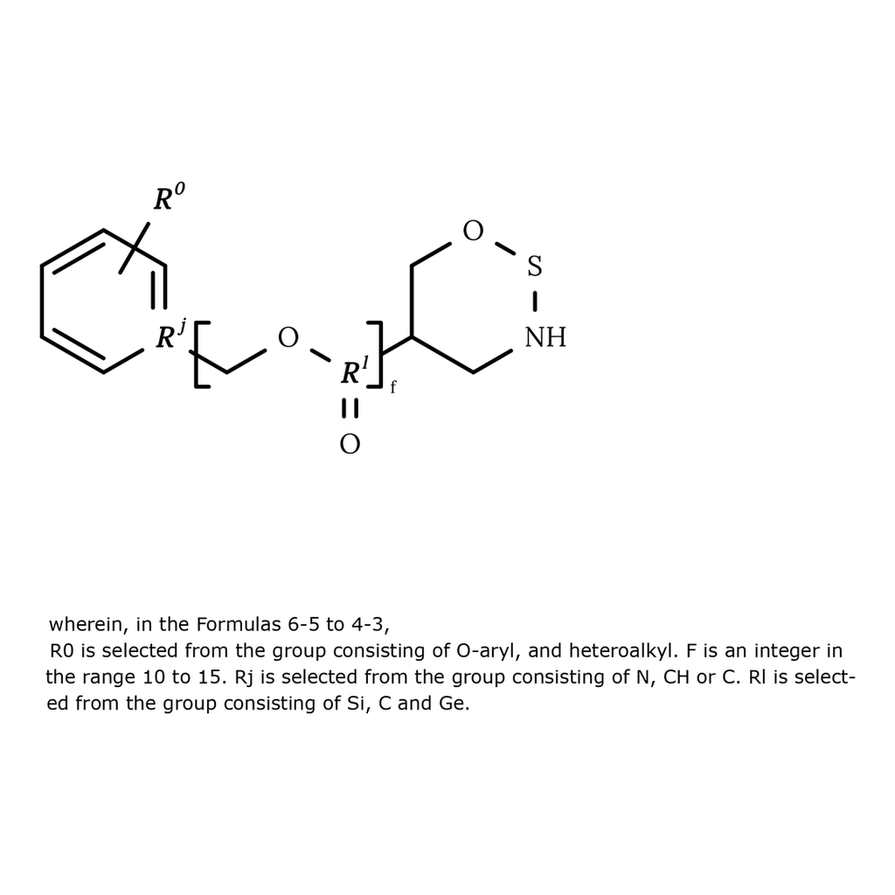

# MarkushGenerator-IBM

This is the repository for the synthetic data generation pipeline of [MarkushGrapher: Joint Visual and Textual Recognition of Markush Structures](https://arxiv.org/abs/2503.16096).

### Installation

1. Create a virtual environment.
```
python3 -m venv markushgenerator-env
source markushgenerator-env/bin/activate
```

2. Install MarkushGenerator.
```
pip install -e .
```

3. Install Java 17 .
```
sudo apt-get install openjdk-17-jdk
sudo update-alternatives --config 'java'
```

4. Download the [CDK](https://github.com/cdk/cdk/releases) library (version `cdk-2.9.jar`) from and move it to `MarkushGenerator/lib/`.
```
wget https://github.com/cdk/cdk/releases/download/cdk-2.9/cdk-2.9.jar -P ./lib/
```

## Generation 

The notebook `MarkushGenerator/markushgenerator/draw.ipynb` shows how to:
1. Draw an image from a CXSMILES.



2. Draw a textual definition associated with the CXSMILES.



Each generated sample contains the: 
- CXSMILES.   
- Optimized CXSMILES.
- Markush structure image.
- OCR cells, containing the position and content of text written in the images. Some characters are currently omitted such as explicit carbons and implicit hydrogens. Atoms with charges are formatted as "atom, charge, numger of charges". Superscripts and subscripts are ignored.
