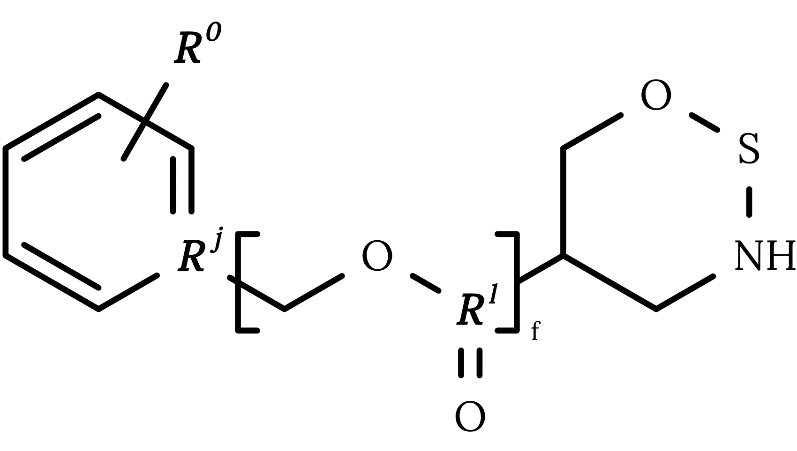
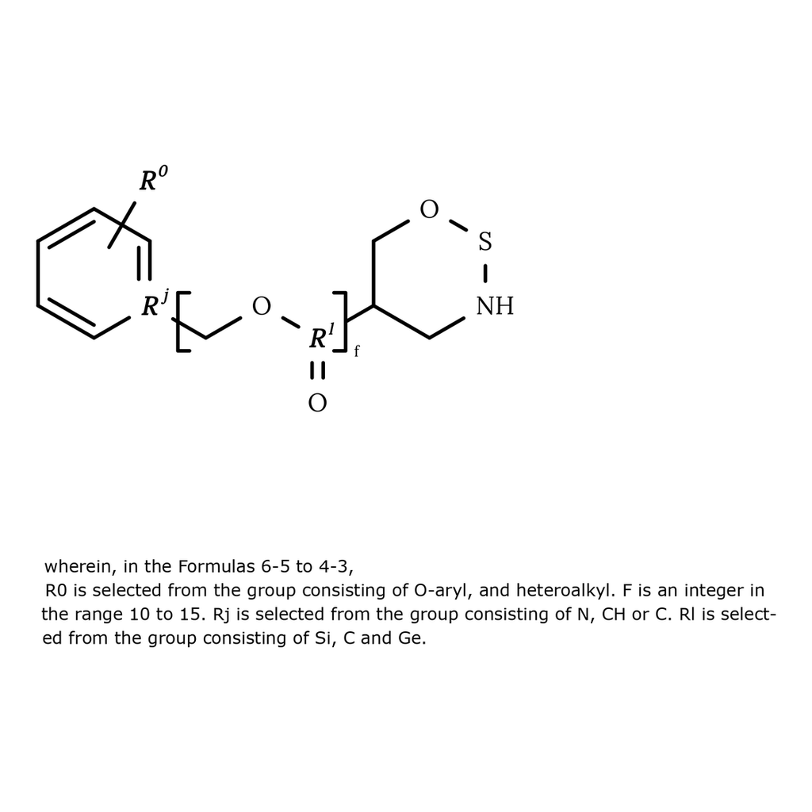

# MarkushGenerator

This is the repository for the synthetic data generation pipeline of Markush Structures. (adapted for MarkushGrapher-2)

## Updates

- **Branch: main**: contains the updated cxsmiles_tokenizer for MarkushGrapher-2 (MarkushGrapher-2: End-to-end Multimodal Recognition
of Chemical Structures)
- **Branch: markushgenerator-1**: contains the original cxsmiles_tokenizer and synthetic data generation pipeline for MarkushGrapher-1 ([MarkushGrapher: Joint Visual and Textual Recognition of Markush Structures](https://arxiv.org/abs/2503.16096).)

### Installation

1. Create a virtual environment.
```
python3.10 -m venv markushgenerator-env
source markushgenerator-env/bin/activate
```

2. Install MarkushGenerator.
```
PIP_USE_PEP517=0 pip install -e .
```

3. Install Java 17.
```
sudo apt-get install openjdk-17-jdk
sudo update-alternatives --config 'java'
```

4. Download the [CDK](https://github.com/cdk/cdk/releases) library (version `cdk-2.9.jar`) from and move it to `MarkushGenerator/lib/`.
```
wget https://github.com/cdk/cdk/releases/download/cdk-2.9/cdk-2.9.jar -P ./lib/
```

## Generation 

The notebook `MarkushGenerator/markushgenerator/draw.ipynb` shows how to:
1. Draw an image from a CXSMILES.



2. Draw a textual definition associated with the CXSMILES.



Each generated sample contains:
- **CXSMILES** — the chemical structure representation.
- **Optimized CXSMILES** — a normalized form of the CXSMILES.
- **Markush structure image** — the rendered chemical diagram.
- **OCR cells** — position and content of text in the images. Some characters are currently omitted (explicit carbons, implicit hydrogens). Atoms with charges are formatted as "atom, charge, number of charges". Superscripts and subscripts are ignored.

